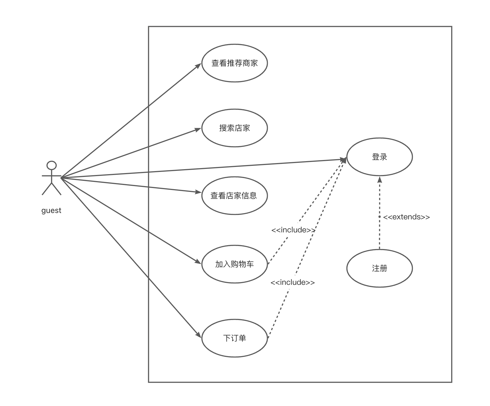

# 需求分析

## 背景

本项目是要实现一个外卖销售的平台，类似参考”美团外卖“app的界面和功能，制作一个网页版的小应用。实现本项目使用了前后端分离的技术，前端运用了vue框架进行开发。

## 需求分析

#### 1. 用户的注册和登录

用户进入网页后，可以在”我的“界面选择登录账户，可以使用的登录方式有两种，可以使用账号密码登录，也可以用手机验证码进行登录。如果账号没有注册过，则会把注册和登录过程结合起来，在登录的同时完成注册。

#### 2. 查看推荐商家

在“首页”界面中，会根据菜品的分类，为顾客推荐不同类型的商家。同时，应用会获取用户的位置信息，并将用户附近的商家推荐给用户。

#### 3. 搜索店家

在“搜索”界面中，用户可以根据关键词对入住平台的商家进行搜索的功能。

#### 4. 查看店家信息

选中一家特定的外卖商家，可以查看商家出售的菜品，从而进行点餐的活动；可以看到店家的优惠活动和特价菜品；可以看到其他顾客对该店家的评价；可以看到店家近期的“活动与服务”和配送信息。

#### 5. 加入购物车

用户可以指定特定的外卖，选择要购买的数量，并将外卖加入到购物车中。

#### 6. 下订单

可以对购物车中的外卖进行下订单的功能。

## 用例图

> 